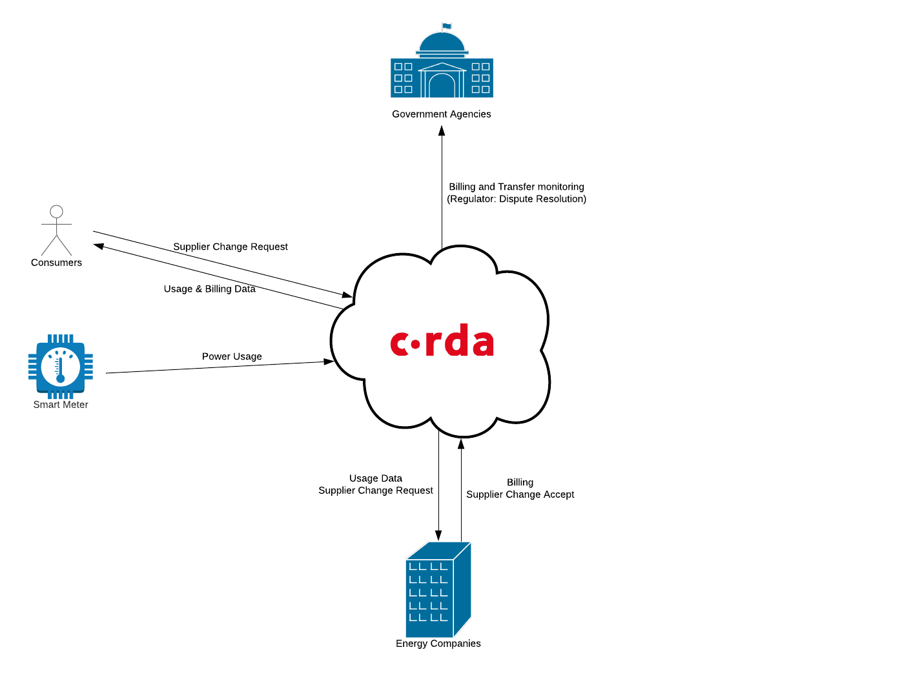
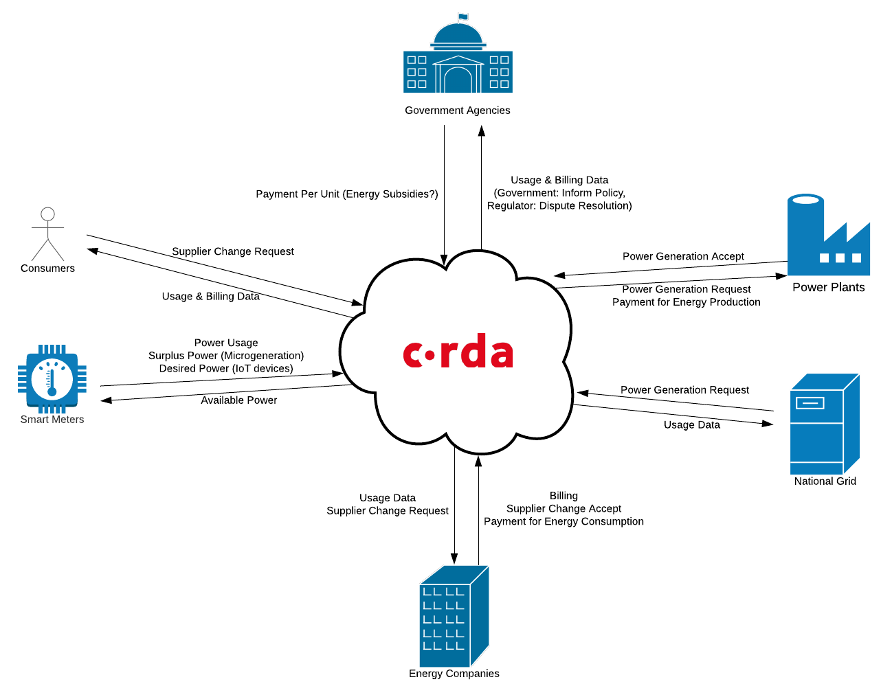

<p align="center">
  
</p>
<h1>Energy Account CorDapp</h1>

### Table of contents
1. [Overview](#overview)
2. [Getting started](#getting-started)
3. [Using the app](#using-the-app)
4. [Advanced](#advanced)
5. [Future enhancements](#future-enhancements)
6. [Vision](#vision)

### Overview

Have you ever transferred your gas / electricity supplier? If so, you'll know how painful it can be.
Whilst there are now services to automate a lot of this for you, when you transfer supplier, you
still have to:

* Provide all of your details to a new supplier from scratch
* Settle a final bill with your old supplier, potentially waiting months for any account credit to
  be returned to you
* Build up a credit again with your new provider

On top of this, in the age of smart meters and climate awareness, consumers may be interested in
monitoring their usage via a web portal on a daily / hourly basis, and being able to see trends over
time. Switching provider means losing all this historic data, and at best, a yearly consumption
figure is provided.

This CorDapp provides a proof of concept of a better way of handling consumer energy accounts,
leveraging the power of distributed ledger technology. This means:

* Customers can transfer accounts to another provider with a single click. All existing customer data,
  meter reading history and billing information is seamlessly transferred to the new supplier.
* Any account balance with the old supplier is transferred to the new supplier. Gone are the days of
  waiting for months to get a refund from your old supplier.
* The government regulator has visibility of accounts, meaning any disputes can be resolved in a more
  timely manner without having to request information directly from a supplier.

### Getting started

It is recommended that you follow the [CorDapp getting started guide](https://docs.corda.net/quickstart-index.html)
to ensure you have the requisite software and environment.

This project comes with a pre-configured test network to allow the application to be quickly run and 
tested. The test network is comprised of:

* A [Notary](https://docs.corda.net/key-concepts-notaries.html) node
* Two supplier nodes - "British Energy" and "UK Power", that represent two different energy suppliers.
  Each of these is formed of a Corda node, and a separate web-server that provides a Web UI which
  communicates with the corresponding Corda node's RPC interface via a RESTful API
* A government regulator node, representing the regulatory body that oversees suppliers. This also
   has a Corda node and corresponding web-server

The nodes can either be run up directly on your local machine, or via Docker compose. The latter
approach is recommended.

The `gradlew` and `runnodes` scripts referred to in the below steps have two variants. Run the `.bat`
versions on Windows, and the scripts without an extension on Linux.

##### Running with Docker Compose

As you might expect, you must have Docker Compose installed on your machine in order for this to work.
To run the application in this mode, you should:

1. Run `gradlew clean prepareDockerNodes`. You only need to run this the first time you are starting
   the application, unless you are changing between running locally or with Docker Compose.
   **Running this command will destroy any existing nodes and their associated data.**
2. In the project root directory, run `docker-compose up`. This will bring up all nodes
   and associated web servers.

To close the app, simply end the process in the terminal window.

##### Running Locally

To run the application locally, you should:

1. Run `gradlew clean prepareLocalNodes`. You only need to run this the first time
   you are starting the application, unless you are changing between running locally or with Docker Compose.
   **Running this command will destroy any existing nodes and their associated data.** 
2. Go to `build/nodes` and execute `runnodes`. This will bring up your Corda nodes. **Make sure your 
   nodes have successfully started before continuing.** You can verify this by looking for the following
   in the console:
   
       `Node for ... started up and registered in ... sec`
      
   If this doesn't happen, yoy may need to hit enter to get the shell to move on, as it can sometimes
   get stuck. You should have 4 nodes running in total; 2 suppliers, the government regulator, and the
   notary.
3. Run each of the following gradle commands in separate terminals:
   ```
   gradlew runBritishEnergyWebCli
   gradlew runUKPowerWebCli
   gradlew runGovtRegulatorWebCli
   ```
 
 When you have finished running the app, you need to execute the `bye` command in each Corda node, and
 also terminate each gradle task for the web servers manually (since these run synchronously).

### Using the app

The supplier and government regulator nodes provide web interfaces via ports that are mapped to your
local machine:

| Node                 | Address           |
|----------------------|-------------------|
| British Energy       | <localhost:10050> |
| UK Power             | <localhost:10051> |
| Government Regulator | <localhost:10052> |

Each of these links will start with an index page that contains links to each of the nodes relevant
web pages, so you can use any of the above links and navigate to all nodes from there.

Each page provides different views of the data:

* The customer portal acts as a login for a single customer, based on a known account id. Customers
  can modify their details, submit meter readings, make payments and initiate a transfer to another
  supplier.
* The supplier portal provides access to all accounts that currently belong to that supplier. Suppliers
  can create, modify and delete accounts, view account details, issue bills, and make account balance
  adjustments.
* The government regulator account monitor provides access to all accounts across all suppliers.
  Currently, the regulator only has the ability to view accounts.

You should create accounts via the supplier portal prior to using the other pages.

##### Baseline data

For convenience, a baseline data set is provided to allow quick creation of a number of accounts
after initialising the nodes. To load this data, you must install the 
[Postman](https://www.getpostman.com/) application. You can then use the following files under
`clients/src/main/resources/baselineData`:

* `dataLoad.postman_collection.json` - Postman collection which should be imported into the application.
* `baselineData.json` - Data file to load within the collection runner window.

##### Known issues

* Viewing customer details in the supplier portal does not update following account changes, meter reading
  submissions or billing events. Selecting another customer row and re-selecting the original customer
  prior to viewing the account details again works around this issue.

### Advanced

When running via Docker, it is possible to access the Corda shells for each node via SSH on ports
mapped to your local machine:

| Node                 | Port  |
|----------------------|------ |
| Notary               | 10113 |
| British Energy       | 10133 |
| UK Power             | 10143 |
| Government Regulator | 10123 |

### Future enhancements

As this is a proof of concept, only basic functionality has been implemented. Some ideas for future
enhancements include:

* **Improved transfer functionality** - prompt the user for a final meter reading and automatically
  generate a final bill with the old supplier before transferring to the new supplier. Could also
  include business validation (e.g. only allowing accounts in credit to be transferred)
* **Payment forwarding** - allow a previous supplier to retain knowledge of a transferred account
  for a period of time, with the ability to "forward" payments to the new supplier. This may be
  useful for "transferring" an existing direct debit
* **Dispute resolution mechanism** - provide a customer the ability to raise a complaint and
  escalate to the regulator. Allow the regulator to provide a resolution (comments and account
  balance adjustments)
* **More generalised app** - arguably, the only thing that is specific to energy accounts in this
  application is the meter reading functionality. The remaining functionality could be useful to
  any kind of consumer account with billing requirements where there is an open supplier market -
  insurance, utilities, property rental etc.
  
### Vision

This proof of concept CorDapp provides a simple implementation of the first phase of developing a
more general energy network:



With more automation, smart meters could be integrated to submit meter readings. However, it is
possible to envision a much grander network:



Eventually, a single energy network could not only provide the functionality implemented in this
CorDapp, but also provide a smart energy trading market between consumers (potentially with their
own micro-generation capacity), energy producers and suppliers, as well as allowing the government /
national grid to better understand usage patterns and availability.
